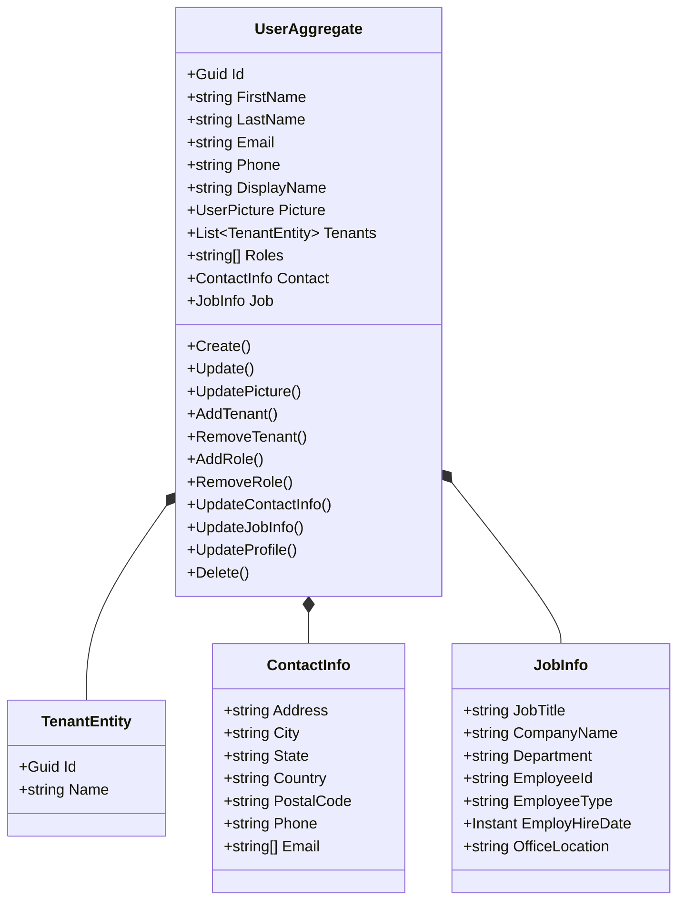
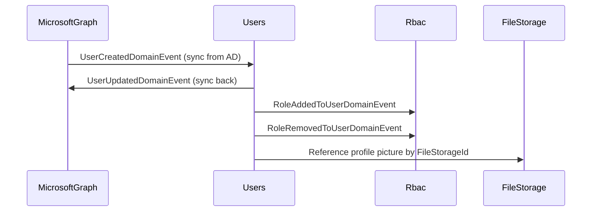

# Users Microservice

## Overview

The Users microservice manages user profiles, their tenant associations, and role assignments within the platform. It stores identity attributes (name, email, phone), profile picture references, contact information, job details, and the list of tenants and roles each user belongs to. It integrates with the MicrosoftGraph microservice for identity provider synchronization and serves as the platform's internal user directory that other microservices reference for user resolution.

## Business Context

A multi-tenant platform requires a user directory that tracks not only who a user is but also which organizations they belong to and what roles they hold within each. The identity provider (Azure AD / CIAM) handles authentication, but the platform needs its own user projection for business-level attributes like tenant memberships, profile pictures, contact details, and job information that go beyond what the identity provider stores.

The Users microservice bridges this gap. When a user is created in the identity provider (via MicrosoftGraph), a corresponding record is created here. Users can belong to multiple tenants (e.g., a property manager overseeing several buildings), and each user has roles assigned that feed into the RBAC system for authorization decisions.

For a new developer: this is the "people directory" of the platform. It knows who everyone is, which organizations they belong to, and what roles they hold.

## Ubiquitous Language

| Term          | Definition                                                                                                                       |
| ------------- | -------------------------------------------------------------------------------------------------------------------------------- |
| User          | A person who interacts with the platform. Identified by a unique GUID that matches their identity provider object ID.            |
| FirstName     | The user's given name.                                                                                                           |
| LastName      | The user's family name.                                                                                                          |
| Email         | The user's primary email address, used for communication and identity correlation.                                                |
| Phone         | The user's contact phone number.                                                                                                 |
| DisplayName   | A computed or customized name shown in the UI (defaults to "FirstName LastName").                                                 |
| Picture       | A reference to the user's profile photo stored in the FileStorage microservice (id, name, target).                                |
| Tenant        | An organization the user belongs to. Users can be members of multiple tenants.                                                    |
| Role          | A named permission group assigned to the user (e.g., "Admin", "Resident", "Security"). Stored as string identifiers.             |
| ContactInfo   | A value object containing the user's full contact details: address, city, state, country, postal code, phones, and emails.        |
| JobInfo       | A value object containing employment details: job title, company, department, employee ID, type, hire date, office location.      |
| AddTenant     | The operation that associates a user with a new organization.                                                                     |
| RemoveTenant  | The operation that dissociates a user from an organization.                                                                       |
| AddRole       | The operation that assigns a new role to the user.                                                                                |
| RemoveRole    | The operation that revokes a role from the user.                                                                                  |
| UpdateProfile | A comprehensive update that modifies identity, contact, and job information in a single operation.                                |
| TenantEntity  | An embedded entity within the user representing a tenant membership (id and name).                                                |

## Domain Model

The Users domain is organized around a single aggregate. The `UserAggregate` holds the user's identity, profile picture, tenant memberships, roles, contact information, and job details. Tenants and roles are managed as collections with add/remove operations that emit specific domain events.

## Data Dictionary

### UserAggregate

The central aggregate representing a platform user.

| Field       | Type                 | Description                                              |
| ----------- | -------------------- | -------------------------------------------------------- |
| Id          | Guid                 | Unique identifier (matches identity provider object ID)  |
| FirstName   | string               | Given name                                               |
| LastName    | string               | Family name                                              |
| Email       | string               | Primary email address                                    |
| Phone       | string               | Contact phone number                                     |
| DisplayName | string?              | UI display name (defaults to "FirstName LastName")       |
| Picture     | UserPicture?         | Profile photo reference (id, name, target)               |
| Tenants     | List\<TenantEntity\> | Organizations the user belongs to                        |
| Roles       | string[]             | Role identifiers assigned to the user                    |
| Contact     | ContactInfo          | Full contact details value object                        |
| Job         | JobInfo              | Employment details value object                          |
| IsActive    | bool                 | Whether the user account is active                       |
| CreatedAt   | Instant              | UTC timestamp of creation                                |
| UpdatedBy   | Guid?                | User who last modified the record                        |
| UpdatedAt   | Instant?             | UTC timestamp of last modification                       |

## Integration Architecture

Users integrates bidirectionally with MicrosoftGraph for identity provider synchronization. It emits events that other microservices consume for user resolution. The FileStorage microservice is referenced for profile pictures.

## Event Catalog

### Events Produced

| Event                           | Trigger                         | Purpose                                      |
| ------------------------------- | ------------------------------- | -------------------------------------------- |
| `UserUpdatedDomainEvent`        | `Update()`                      | Notifies profile changes                     |
| `UserPictureUpdatedDomainEvent` | `UpdatePicture()`               | Notifies profile picture change              |
| `TenantAddedDomainEvent`        | `AddTenant()`                   | User joined a new organization               |
| `TenantRemovedDomainEvent`      | `RemoveTenant()`                | User left an organization                    |
| `RoleAddedToUserDomainEvent`    | `AddRole()`                     | Role assigned to user                        |
| `RoleRemovedToUserDomainEvent`  | `RemoveRole()`                  | Role revoked from user                       |
| `ContactInfoUpdatedDomainEvent` | `UpdateContactInfo()`           | Contact details changed                      |
| `JobInfoUpdatedDomainEvent`     | `UpdateJobInfo()`               | Employment details changed                   |
| `ProfileUpdatedDomainEvent`     | `UpdateProfile()`               | Comprehensive profile update                 |
| `UserDeletedDomainEvent`        | `Delete()`                      | User account soft-deleted                    |

## API Reference

Base path: `/api`

### Users

| Method | Path                            | Description                                      | Auth    |
| ------ | ------------------------------- | ------------------------------------------------ | ------- |
| GET    | `/api/User`                     | Paginated list of users (supports Criteria)      | Bearer  |
| GET    | `/api/User/{id}`                | Get a user by ID                                 | Bearer  |
| POST   | `/api/User`                     | Create a new user                                | Bearer  |
| PUT    | `/api/User/{id}`                | Update user profile                              | Bearer  |
| PUT    | `/api/User/{id}/picture`        | Update profile picture                           | Bearer  |
| POST   | `/api/User/{id}/tenant`         | Add tenant membership                            | Bearer  |
| DELETE | `/api/User/{id}/tenant/{tid}`   | Remove tenant membership                         | Bearer  |
| POST   | `/api/User/{id}/role`           | Add role to user                                 | Bearer  |
| DELETE | `/api/User/{id}/role/{role}`    | Remove role from user                            | Bearer  |
| DELETE | `/api/User/{id}`                | Soft-delete user                                 | Bearer  |

All endpoints return RFC 7807 Problem Details on error. List responses use `Pagination<T>`.

## Key Design Decisions

- **Multi-tenant membership:** A single user can belong to multiple tenants, supporting scenarios like property managers overseeing several buildings or consultants working across organizations.

- **Roles as strings:** Roles are stored as string identifiers rather than GUIDs to allow flexible matching with identity provider group names and RBAC role names.

- **Profile picture as reference:** The user stores only a reference (id, name, target) to the actual file in FileStorage, maintaining separation of concerns.

- **Identity provider ID as aggregate ID:** The user's GUID matches the identity provider object ID, enabling direct correlation without a mapping table.

- **Granular update operations:** Rather than a single monolithic update, the aggregate provides specific operations (UpdatePicture, AddTenant, AddRole, UpdateContactInfo, UpdateJobInfo) each emitting targeted events for downstream consumers.

- **Duplicate guards:** AddTenant and AddRole check for existing memberships/roles before adding, preventing duplicates without throwing errors that would complicate idempotent event processing.

## Related Microservices

| Microservice   | Direction     | Integration Point                                                      |
| -------------- | ------------- | ---------------------------------------------------------------------- |
| MicrosoftGraph | Bidirectional | Syncs user creation/updates between platform and identity provider     |
| Rbac           | Outbound      | Consumes role assignment events for permission cache invalidation      |
| FileStorage    | Reference     | Profile pictures stored and retrieved via FileStorage                  |
| Tenants        | Reference     | Tenant memberships reference tenant IDs from the Tenants microservice  |
